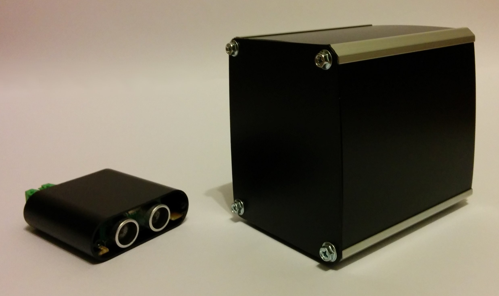
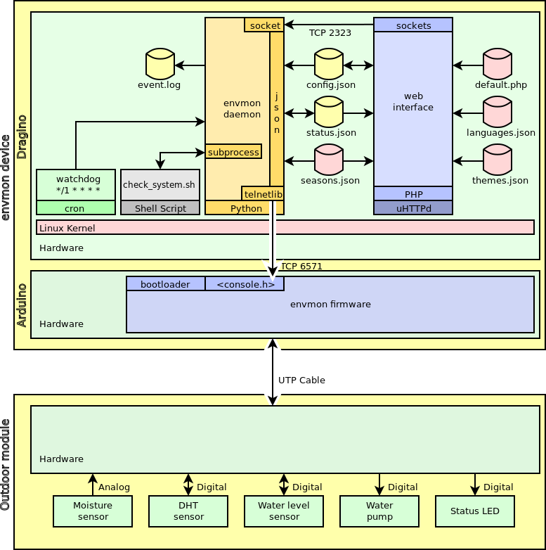

# envmon Mark I - Environment Monitor

## Introduction

### System architecture

## Changes
All notable changes to this project will be documented in this [Change log](CHANGELOG.md).

## Mechanics
This project uses an original mech made from scratch with the following goals:
- Reliable
- Precise
- Robust
- Almost cheap, but well done

Check out [Mechanics](Mechanics/README.md) design to know more.

## Electronics
Arduino Leonardo and Arduino Yún Shield is used with other [Electronics](Electronics/README.md) parts to control the system.

## Firmware
A fully original [Firmware](enm1/README.md) was developed to this project.

## Software
A nice web interface is used to configure and get stats from system. This [Software](Software/README.md) was wrote using actual development trends.

## BOM - Bill of materials
If you want to build your own, take a look at [Bill of materials](BOM.md).

## Project Kanban
This project is always under enhancements. I use [Kanban](KANBAN.md) to control project evolution.

---
